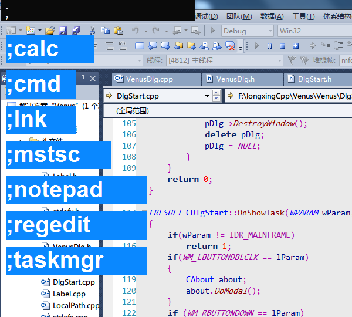

# Venus (启明星)

### 介绍
快捷键启动引导程序。花了两天时间，东拼西凑出来的。

之前用过多款启动辅助程序，如：Launchy、ALTRun、音速启动、吉特盒子，用的最长时间（一直到自己这个程序开发完成之前）是吉特盒子。
刚才这段时间在学习VC，就顺手自己做一个出来，不需要那些花哨的功能，仅仅做引导就够了。

预览：

### 使用说明

1. 使用`Alt+SpaceBar`作为热键，主窗体隐藏，热键打开透明色输入窗口
2. 打开时程序读取目录lnk内的快捷方式文件，供用户输入关键字并索引，采用左匹配方式，回车后运行第一个结果
3. 目录lnk内的快捷方式文件需要用户自行添加
4. 增加以`;(分号)`开头的系统组件引导，已实现组件：calc、cmd、mstsc、notepad、regedit、taskmgr
5. 增加打开lnk目录的快捷启动键`;lnk`

### 历史版本

##### v1.0.3 - 2016/10/26

NEW:

1. 系统组件增加画板mspaint、服务services、系统启动项
2. ctrl+enter, 百度搜索关键字
3. shift+enter, dict.cn字典查询

##### v1.0.2 - 2015/5/13  

NEW:

> 增加随系统自启动选项的勾选实现

FIX:

> 1. 变更输入窗口显隐方式
> 2. 优化内存占用问题

##### v1.0.1 - 2015/5/12  

NEW:

> 增加防止多程序启动功能，仅能运行一个实例

##### v1.0.0 - 2015/5/12  

百度各种功能（遍历文件、解析lnk文件、窗口透明色及隐藏、控件字体颜色及大小），集合进来，完成基本功能框架。

NEW：

> 1. 热键窗体隐藏
> 2. 读取目录内的快捷方式文件
> 3. 系统组件引导

### TODO

1. 根据屏幕分辨率自动换行显示更多的标签
2. 使用`*`来通配字符实现模糊匹配